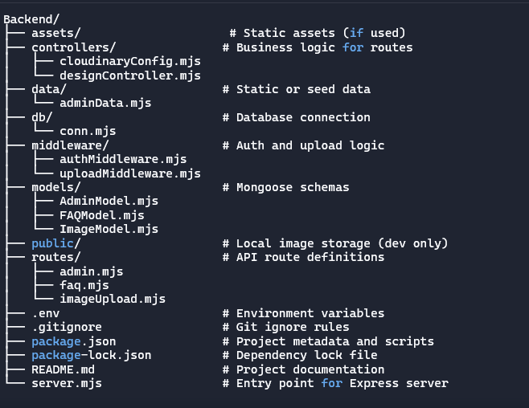
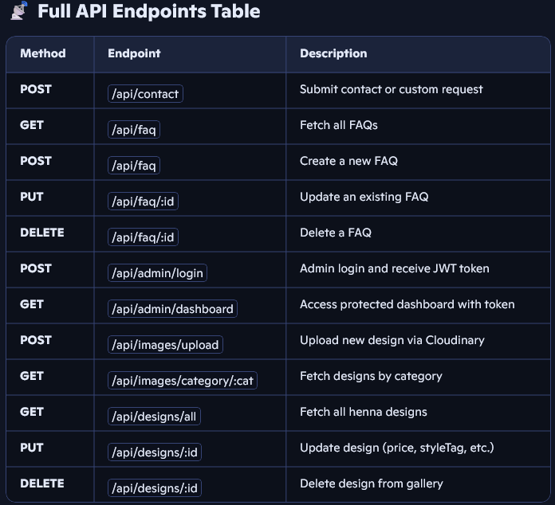

## ⚙️ HennaBloom Studio – Backend
HennaBloom Studio’s backend powers a modular, secure, and scalable henna design platform. Built with Express and MongoDB, it handles image uploads, booking logic, contact forms, and admin authentication — all designed to support a seamless frontend experience.

## 🧱 Backend Setup Roadmap
- ✅Initialize the project
- ✅Install dependencies
- ✅Create folder structure
- ✅Set up Express server
- ✅Connect to MongoDB
- ✅Create models (Design, Order, Contact)
- ✅Build routes (CRUD for each model)
- ✅Test with Postman or frontend
- ✅Enable CORS and middleware
- ✅Deploy to Render

## 🧬 Backend Functionality
- RESTful API built with Express and MongoDB
- CRUD routes for designs, orders, and contact messages
- CORS-enabled for frontend communication
- Scalable model structure using Mongoose
- JWT-based admin authentication
- Cloudinary-powered image uploads
- Modular route and model organization

## Error Handling
- HennaBloom Studio uses a centralized Express middleware (errorHandler.mjs) to manage all backend errors consistently and securely.

## 📁 Folder Structure

## 🔌API Endpoints Consumed

## 🔐 Admin Password Hashing with bcrypt
To ensure secure storage of admin credentials, HennaBloom Studio uses bcrypt to hash passwords before saving them to the database. This prevents plain-text password exposure and supports safe authentication.

## 📸 Cloudinary Integration
- Cloudinary handles image uploads and delivery
- Uploaded images are stored in a dedicated Cloudinary folder
- Public URLs are returned and saved in MongoDB
- URLs are used in the frontend for preview and display

## 📸 Image Upload Strategy
This project uses Cloudinary and Multer to handle image uploads and delivery.
- Multer parses incoming multipart/form-data requests from the frontend.
- multer-storage-cloudinary connects Multer to Cloudinary for seamless upload.
- Uploaded images are stored in a dedicated Cloudinary folder.
- Cloudinary returns a public URL, which is saved in MongoDB and used in the    frontend for preview and display.

## 🧰 Tech Stack
- Express.js
- MongoDB + Mongoose
- Cloudinary (Node.js SDK)
- Multer + multer-storage-cloudinary
- bcrypt for password hashing
- jsonwebtoken for authentication
- dotenv for secure credential management

## 🔒 Security Practices
- Passwords hashed with bcrypt
- JWT used for admin route protection
- CORS enabled for frontend communication
- `.env` used for sensitive credentials

## 🔐 Environment Variables (.env)
Create a .env file in your backend root directory with the following keys

PORT=3000
MONGODB_URI=your_mongodb_connection_string
CLOUDINARY_CLOUD_NAME=your_cloudinary_cloud_name
CLOUDINARY_API_KEY=your_cloudinary_api_key
CLOUDINARY_API_SECRET=your_cloudinary_api_secret
JWT_SECRET=your_jwt_secret_key

## 🚀 Setup Instruction
 1. Clone the repo
git clone https://github.com/savita-aher/HennaStudio_BackEnd
 
 2. Install dependencies
- $npm init -y
- npm install express mongoose cors dotenv
- npm install --save-dev nodemon
- npm install bcrypt
- npm install cloudinary multer multer-storage-cloudinary dotenv
- npm install jsonwebtoken

3. Create a .env file and add your credentials
touch .env (Paste the keys listed above)

4. Start the server
npm run dev

